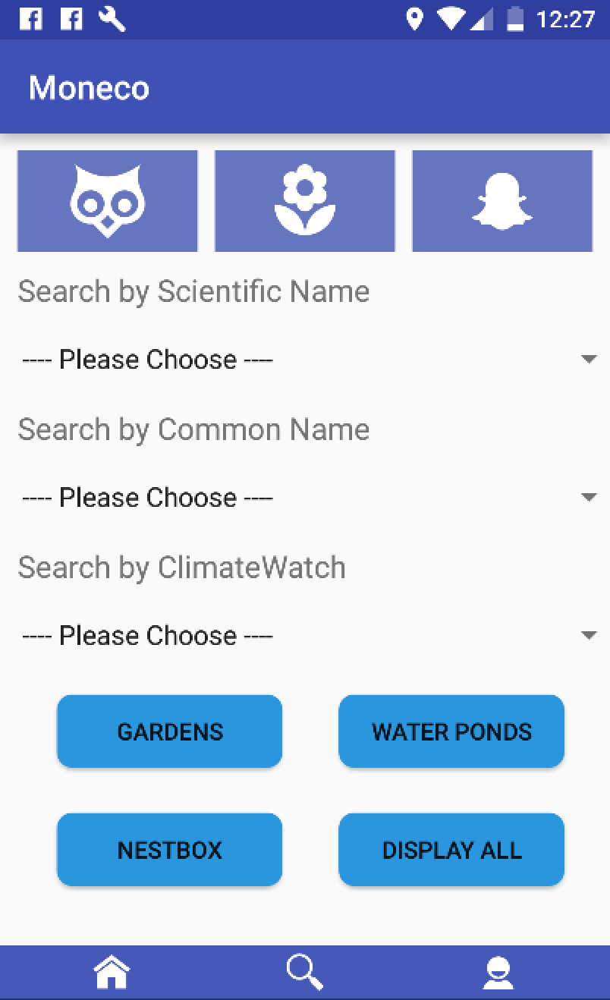
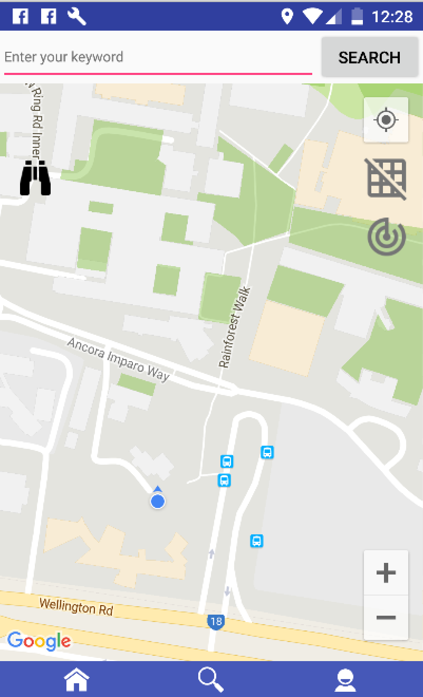
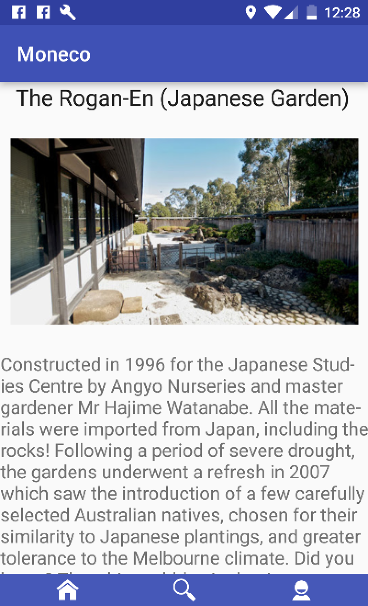
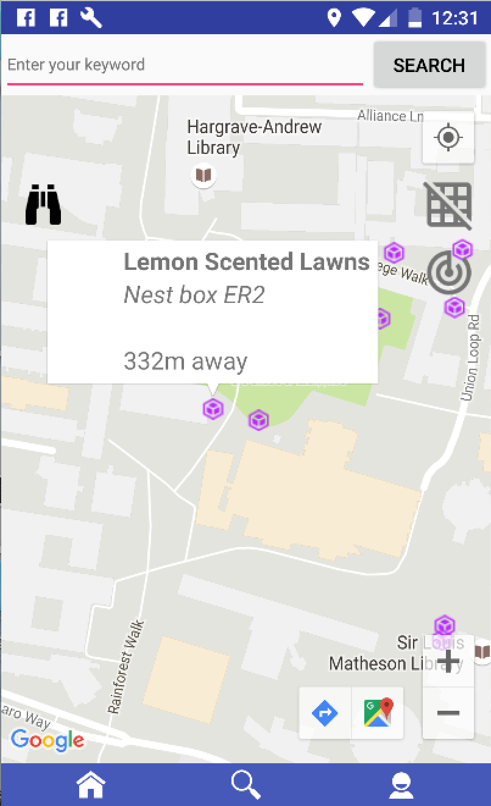
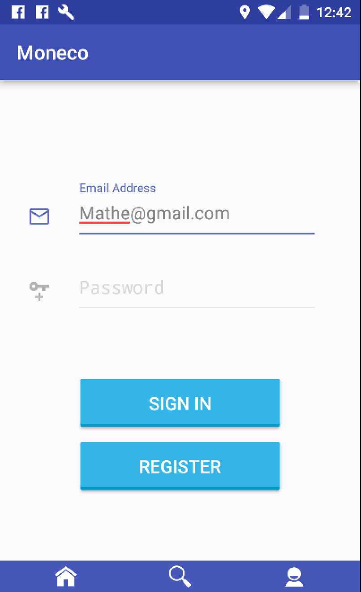

# Moneco Demonstration
**MONECO Project** which consists of Mobile Application and Web Server is based on LAMP model.

**MONECO Mobile Application** utilizes Java programming language to help users identify and locate species and gardens on  Monash Clayton campus. The application allows users to upload their sightings and to share observations as well. The application is a large part of MONECO Project.

Apache Httpd Server was used as **MONECO Web Server**. Users’ data are stored in MySQL on Server and the data are accessible by using PHP language. System environment of server is Linux. MVC pattern be used to develop this project.

# Screenshots of Mobile Application
#### • `map intial screen`

•`species list in grid` | `popup information when tap specific grid` | `monitor current area`
#### • `species list in grid` | `popup information when tap specific grid` | `monitor current area`

#### • `nearby species`

#### • `search screen`

#### • `garden on map`

#### • `garden display`

#### • `garden entrances`

#### • `water ponds`

#### • `nestbox`

#### • `display all species`

#### • `media display`

#### • `share to social media`

#### • `species find on map`

#### • `login`

#### • `register`

#### • `user profile` | `delete favorite record` | `view upload history`

#### • `uploadObservation with image and audio`

# Credits
I used [polygon-contains-point](https://github.com/sromku/polygon-contains-point) library and algorithm by Roman Kushnarenko as a polygon calculation method for development. 
I used [AVLoadingIndicatorView](https://github.com/81813780/AVLoadingIndicatorView) library by jack wang as a part of UI design for development. 
I used [android-process-button](https://github.com/dmytrodanylyk/android-process-button/wiki/User-Guide) library by Dmytro Danylyk as a part of UI design for development. 
I used [MaterialEditText](https://github.com/rengwuxian/MaterialEditText) library by rengwuxian as a part of UI design for development.

# Acknowledgements
UI images are from [google Image](https://images.google.com/), [materialdesignicons](https://materialdesignicons.com/) and [iconmonstr](http://iconmonstr.com/) website, Species Images are from [Atlas Of Living Australia](http://www.ala.org.au/) and [Museum Victoria](https://museumvictoria.com.au/)

# License
   Copyright {2016} {Liangchen Zhou, Huashun Li}
   
   Licensed under the Apache License, Version 2.0 (the "License");
   you may not use this file except in compliance with the License.
   You may obtain a copy of the License at
   
       http://www.apache.org/licenses/LICENSE-2.0
       
   Unless required by applicable law or agreed to in writing, software
   distributed under the License is distributed on an "AS IS" BASIS,
   WITHOUT WARRANTIES OR CONDITIONS OF ANY KIND, either express or implied.
   See the License for the specific language governing permissions and
   limitations under the License.
